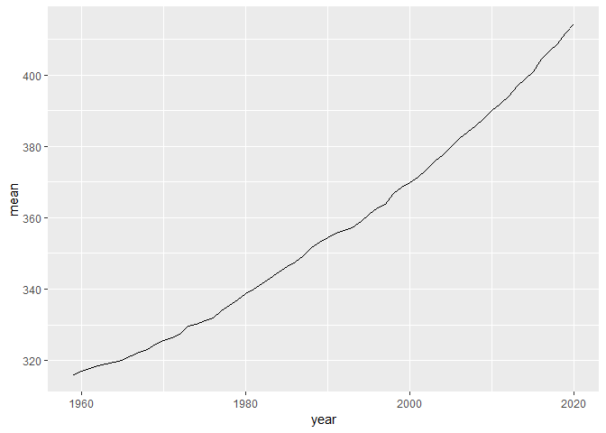

Case Study 08
================
Maris Grundy
October 26, 2021

``` r
library(tidyverse)
library(knitr)
library(kableExtra)

URL<- "https://gml.noaa.gov/webdata/ccgg/trends/co2/co2_annmean_mlo.txt"
Data<- read_table(URL, skip=57, col_names=c("year", "mean", "unc"))
```

``` r
ggplot(data=Data, aes(x=year, y=mean))+
  geom_line()
```

<!-- -->

``` r
top5 <- Data %>%
  arrange(desc(mean))%>%
  top_n(mean, n=5)

knitr::kable(top5)
```

<table>
<thead>
<tr>
<th style="text-align:right;">
year
</th>
<th style="text-align:right;">
mean
</th>
<th style="text-align:right;">
unc
</th>
</tr>
</thead>
<tbody>
<tr>
<td style="text-align:right;">
2020
</td>
<td style="text-align:right;">
414.24
</td>
<td style="text-align:right;">
0.12
</td>
</tr>
<tr>
<td style="text-align:right;">
2019
</td>
<td style="text-align:right;">
411.66
</td>
<td style="text-align:right;">
0.12
</td>
</tr>
<tr>
<td style="text-align:right;">
2018
</td>
<td style="text-align:right;">
408.72
</td>
<td style="text-align:right;">
0.12
</td>
</tr>
<tr>
<td style="text-align:right;">
2017
</td>
<td style="text-align:right;">
406.76
</td>
<td style="text-align:right;">
0.12
</td>
</tr>
<tr>
<td style="text-align:right;">
2016
</td>
<td style="text-align:right;">
404.41
</td>
<td style="text-align:right;">
0.12
</td>
</tr>
</tbody>
</table>
