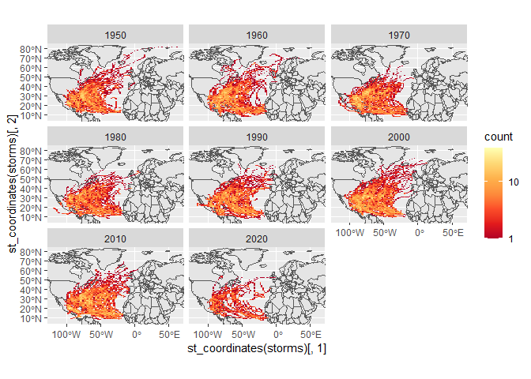

Case Study 09
================
Maris Grundy
November 11, 2021

\#Load Packages

``` r
library(sf)
library(tidyverse)
library(ggmap)
library(rnoaa)
library(spData)
data(world)
data(us_states)
```

\#Data Wrangle

``` r
# Download zipped data from noaa with storm track information
dataurl="https://www.ncei.noaa.gov/data/international-best-track-archive-for-climate-stewardship-ibtracs/v04r00/access/shapefile/IBTrACS.NA.list.v04r00.points.zip"
tdir=tempdir()
download.file(dataurl,destfile=file.path(tdir,"temp.zip"))
unzip(file.path(tdir,"temp.zip"),exdir = tdir)
list.files(tdir)
```

    ## [1] "file2f8c6216289f"                  "file2f8c76ffedc"                  
    ## [3] "IBTrACS.NA.list.v04r00.points.dbf" "IBTrACS.NA.list.v04r00.points.prj"
    ## [5] "IBTrACS.NA.list.v04r00.points.shp" "IBTrACS.NA.list.v04r00.points.shx"
    ## [7] "temp.zip"

``` r
storm_data <- read_sf(list.files(tdir,pattern=".shp",full.names = T))
```

\#Filter Data

``` r
#filter storms
storms<- storm_data %>%
  filter(SEASON > 1949) %>%
  mutate_if(is.numeric, function(x) ifelse(x==-999.0,NA,x)) %>%
  mutate(decade=(floor(year/10)*10))
  
region <- st_bbox(storms) 
```

\#Plot this baby

``` r
#make first plot
ggplot()+
  geom_sf(data=world, inherit.aes=F)+
  facet_wrap(~decade)+
  stat_bin2d(data=storms, aes(y=st_coordinates(storms)[,2], x=st_coordinates(storms)[,1]),bins=100)+
  scale_fill_distiller(palette="YlOrRd", trans="log", direction=-1, breaks = c(1,10,100,1000))+
  coord_sf(ylim=region[c(2,4)], xlim=region[c(1,3)])
```

<!-- -->

\#Where is stormiest?

``` r
#Calculate table of the five states with most storms
#st_crs(storms)

us_states<- st_transform(us_states, st_crs(storms))

#change name column
states<- us_states %>% 
  select(state=NAME)

#spatial join
storm_states <- st_join(storms, states, join = st_intersects,left = F) %>%
  group_by(state) %>%
  summarize(storms=length(unique(NAME))) %>%
  arrange(desc(storms)) %>%
  slice(1:5)
```

\#Table of stormiest

    ## Simple feature collection with 5 features and 2 fields
    ## Geometry type: MULTIPOINT
    ## Dimension:     XY
    ## Bounding box:  xmin: -106.37 ymin: 24.6 xmax: -75.9 ymax: 36.55
    ## Geodetic CRS:  WGS 84
    ## # A tibble: 5 x 3
    ##   state          storms                                                 geometry
    ##   <chr>           <int>                                         <MULTIPOINT [°]>
    ## 1 Florida            84 ((-86.94 30.95), (-87.21 30.92), (-87.44 30.89), (-87.5~
    ## 2 North Carolina     64 ((-81.67 36.55), (-82 35.8), (-81.7 35.9), (-81.6 36), ~
    ## 3 Georgia            60 ((-83.12 34.34), (-83.5 34.5), (-83.28 34.65), (-83.76 ~
    ## 4 Texas              54 ((-94.09 33.48), (-94.9 33.5), (-94.56 33.36), (-94.5 3~
    ## 5 Louisiana          52 ((-90.6 29.4), (-90.5 29.4), (-90.3 29.3), (-90.29 29.2~
