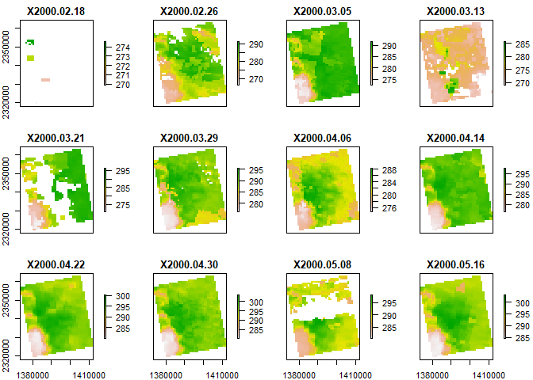
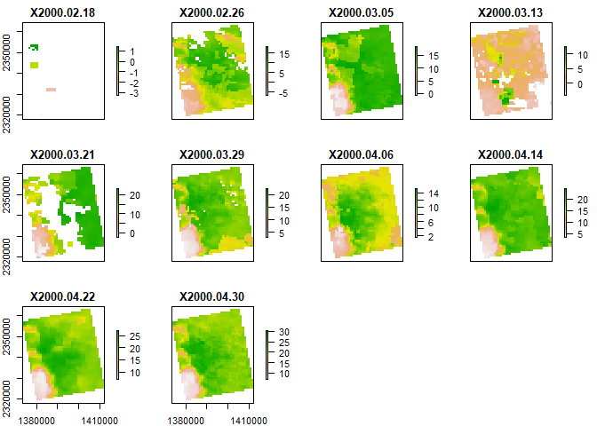

Case Study 10
================
Maris Grundy
November 9, 2021

``` r
#Import Libraries

library(raster)
library(rasterVis)
library(rgdal)
library(ggmap)
library(tidyverse)
library(knitr)

# New Packages
library(ncdf4) # to import data from netcdf format
```

``` r
#Identify and create download folders
dir.create("data",showWarnings = F) #create a folder to hold the data

lulc_url="https://github.com/adammwilson/DataScienceData/blob/master/inst/extdata/appeears/MCD12Q1.051_aid0001.nc?raw=true"
lst_url="https://github.com/adammwilson/DataScienceData/blob/master/inst/extdata/appeears/MOD11A2.006_aid0001.nc?raw=true"

# download them
download.file(lulc_url,destfile="data/MCD12Q1.051_aid0001.nc", mode="wb")
download.file(lst_url,destfile="data/MOD11A2.006_aid0001.nc", mode="wb")

#Load data into R
lulc=stack("data/MCD12Q1.051_aid0001.nc",varname="Land_Cover_Type_1")
```

    ## [1] ">>>> WARNING <<<  attribute latitude_of_projection_origin is an 8-byte value, but R"
    ## [1] "does not support this data type. I am returning a double precision"
    ## [1] "floating point, but you must be aware that this could lose precision!"
    ## [1] ">>>> WARNING <<<  attribute longitude_of_central_meridian is an 8-byte value, but R"
    ## [1] "does not support this data type. I am returning a double precision"
    ## [1] "floating point, but you must be aware that this could lose precision!"
    ## [1] ">>>> WARNING <<<  attribute longitude_of_projection_origin is an 8-byte value, but R"
    ## [1] "does not support this data type. I am returning a double precision"
    ## [1] "floating point, but you must be aware that this could lose precision!"
    ## [1] ">>>> WARNING <<<  attribute straight_vertical_longitude_from_pole is an 8-byte value, but R"
    ## [1] "does not support this data type. I am returning a double precision"
    ## [1] "floating point, but you must be aware that this could lose precision!"
    ## [1] ">>>> WARNING <<<  attribute false_easting is an 8-byte value, but R"
    ## [1] "does not support this data type. I am returning a double precision"
    ## [1] "floating point, but you must be aware that this could lose precision!"
    ## [1] ">>>> WARNING <<<  attribute false_northing is an 8-byte value, but R"
    ## [1] "does not support this data type. I am returning a double precision"
    ## [1] "floating point, but you must be aware that this could lose precision!"

``` r
lst=stack("data/MOD11A2.006_aid0001.nc",varname="LST_Day_1km")
```

    ## [1] ">>>> WARNING <<<  attribute latitude_of_projection_origin is an 8-byte value, but R"
    ## [1] "does not support this data type. I am returning a double precision"
    ## [1] "floating point, but you must be aware that this could lose precision!"
    ## [1] ">>>> WARNING <<<  attribute longitude_of_central_meridian is an 8-byte value, but R"
    ## [1] "does not support this data type. I am returning a double precision"
    ## [1] "floating point, but you must be aware that this could lose precision!"
    ## [1] ">>>> WARNING <<<  attribute longitude_of_projection_origin is an 8-byte value, but R"
    ## [1] "does not support this data type. I am returning a double precision"
    ## [1] "floating point, but you must be aware that this could lose precision!"
    ## [1] ">>>> WARNING <<<  attribute straight_vertical_longitude_from_pole is an 8-byte value, but R"
    ## [1] "does not support this data type. I am returning a double precision"
    ## [1] "floating point, but you must be aware that this could lose precision!"
    ## [1] ">>>> WARNING <<<  attribute false_easting is an 8-byte value, but R"
    ## [1] "does not support this data type. I am returning a double precision"
    ## [1] "floating point, but you must be aware that this could lose precision!"
    ## [1] ">>>> WARNING <<<  attribute false_northing is an 8-byte value, but R"
    ## [1] "does not support this data type. I am returning a double precision"
    ## [1] "floating point, but you must be aware that this could lose precision!"

``` r
#Plot all data
plot(lulc)
```

<!-- -->

``` r
#Plot
lulc=lulc[[13]]
plot(lulc)
```

<!-- -->

``` r
#Process land cover data
 Land_Cover_Type_1 = c(
    Water = 0, 
    `Evergreen Needleleaf forest` = 1, 
    `Evergreen Broadleaf forest` = 2,
    `Deciduous Needleleaf forest` = 3, 
    `Deciduous Broadleaf forest` = 4,
    `Mixed forest` = 5, 
    `Closed shrublands` = 6,
    `Open shrublands` = 7,
    `Woody savannas` = 8, 
    Savannas = 9,
    Grasslands = 10,
    `Permanent wetlands` = 11, 
    Croplands = 12,
    `Urban & built-up` = 13,
    `Cropland/Natural vegetation mosaic` = 14, 
    `Snow & ice` = 15,
    `Barren/Sparsely vegetated` = 16, 
    Unclassified = 254,
    NoDataFill = 255)

lcd=data.frame(
  ID=Land_Cover_Type_1,
  landcover=names(Land_Cover_Type_1),
  col=c("#000080","#008000","#00FF00", "#99CC00","#99FF99", "#339966", "#993366", "#FFCC99", "#CCFFCC", "#FFCC00", "#FF9900", "#006699", "#FFFF00", "#FF0000", "#999966", "#FFFFFF", "#808080", "#000000", "#000000"),
  stringsAsFactors = F)
# colors from https://lpdaac.usgs.gov/about/news_archive/modisterra_land_cover_types_yearly_l3_global_005deg_cmg_mod12c1
kable(head(lcd))
```

|                             |  ID | landcover                   | col      |
|:----------------------------|----:|:----------------------------|:---------|
| Water                       |   0 | Water                       | \#000080 |
| Evergreen Needleleaf forest |   1 | Evergreen Needleleaf forest | \#008000 |
| Evergreen Broadleaf forest  |   2 | Evergreen Broadleaf forest  | \#00FF00 |
| Deciduous Needleleaf forest |   3 | Deciduous Needleleaf forest | \#99CC00 |
| Deciduous Broadleaf forest  |   4 | Deciduous Broadleaf forest  | \#99FF99 |
| Mixed forest                |   5 | Mixed forest                | \#339966 |

``` r
#Converting LULC raster into a categorical raster
# convert to raster (easy)
lulc=as.factor(lulc)

# update the RAT with a left join
levels(lulc)=left_join(levels(lulc)[[1]],lcd)

## Joining, by = "ID"
# plot it
gplot(lulc)+
  geom_raster(aes(fill=as.factor(value)))+
  scale_fill_manual(values=levels(lulc)[[1]]$col,
                    labels=levels(lulc)[[1]]$landcover,
                    name="Landcover Type")+
  coord_equal()+
  theme(legend.position = "bottom")+
  guides(fill=guide_legend(ncol=5, nrow = 3, byrow=TRUE))
```

<!-- -->

``` r
#Land surface temp
plot(lst[[1:12]])
```

<!-- -->

``` r
#Convert LST to degrees C
offs(lst)=-273.15
plot(lst[[1:10]])
```

<!-- -->

``` r
#Add Dates to Z (time) dimension
names(lst)[1:5]
```

    ## [1] "X2000.02.18" "X2000.02.26" "X2000.03.05" "X2000.03.13" "X2000.03.21"

``` r
## [1] "X2000.02.18" "X2000.02.26" "X2000.03.05" "X2000.03.13" "X2000.03.21"

#Convert values to R date format
tdates=names(lst)%>%
  sub(pattern="X",replacement="")%>%
  as.Date("%Y.%m.%d")

names(lst)=1:nlayers(lst)
lst=setZ(lst,tdates)
```

Part 1: Extract timeseries for a point

``` r
#Extract LST values for a single point and plot them.

lw<-SpatialPoints(data.frame(x= -78.791547,y=43.007211))
projection(lw) = "+proj=longlat"
lw<- spTransform(lw, crs(lst))
ts<- raster::extract(lst,lw,buffer=1000,fun=mean,na.rm=T)
ts<-t(ts)
ts_df<- data.frame(temperature= ts, date=getZ(lst))

ggplot(ts_df, aes(date, temperature))+
    geom_point()+
    geom_smooth(n=100, span=0.05, color="green")+
    labs(x="Date", y="Montly Mean Land Surface Temperature")
```

<!-- --> Part
2: Summarize weekly data to monthly climatologies

``` r
tmonth<- as.numeric(format(getZ(lst),"%m"))
lst_month<- stackApply(lst, tmonth, fun=mean)
names(lst_month)=month.name

#plot for each month
gplot(lst_month)+
  geom_tile(aes(fill=value))+
  facet_wrap(~variable)+
  scale_fill_gradient(low="blue", high="orange")+
  coord_equal()
```

<!-- -->

``` r
cellStats(lst_month,mean)
```

    ##   January  February     March     April       May      June      July    August 
    ## -2.127507  8.710271 18.172077 23.173591 26.990005 28.840144 27.358260 22.927727 
    ## September   October  November  December 
    ## 15.477510  8.329881  0.586179 -4.754134
